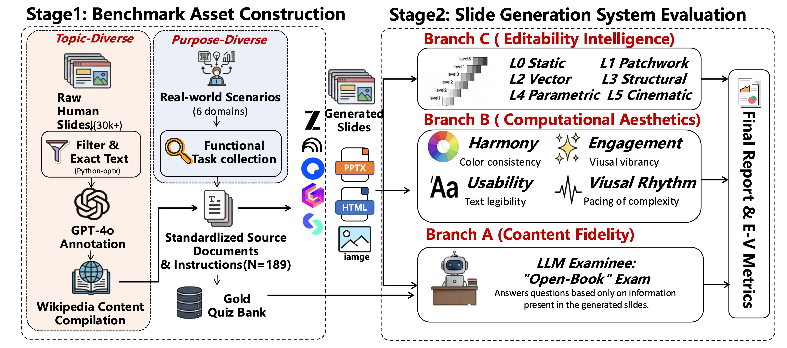

<p align="center">
  
</p>

<p align="center">
  <b>🎯 A Comprehensive Benchmark for Evaluating AI-Generated Presentations</b>
</p>

<p align="center">
  <a href="https://arxiv.org/abs/2601.09487">
    
  </a>
  <a href="https://huggingface.co/datasets/Yqy6/Slides-Align">
    
  </a>
  <a href="https://slidesgenbench.yqy314.top/">
    
  </a>
  <a href="#license">
    
  </a>
</p>

<p align="center">
  <a href="#-abstract">Abstract</a> •
  <a href="#-installation">Installation</a> •
  <a href="#-evaluation-pipeline">Evaluation</a> •
  <a href="#-Slides-Align-dataset">Dataset</a> •
  <a href="#-license">License</a>
</p>

---

## 📖 Abstract

The rapid evolution of Large Language Models (LLMs) has fostered diverse paradigms for automated slide generation, ranging from code-driven layouts to image-centric synthesis. However, evaluating these heterogeneous systems remains challenging, as existing protocols often struggle to provide comparable scores across architectures or rely on uncalibrated judgments.

In this paper, we introduce **SlidesGen-Bench**, a benchmark designed to evaluate slide generation through a lens of three core principles:

| Principle | Description |
|:---------:|:------------|
| 🌐 **Universality** | Unified visual-domain evaluation framework agnostic to generation methods |
| 📊 **Quantification** | Reproducible metrics across *Content*, *Aesthetics*, and *Editability* |
| ✅ **Reliability** | High correlation with human preference via the Slides-Align dataset |

<p align="center">
  
</p>

---

## 🚀 Installation

```bash
# Clone the repository
git clone https://github.com/yunqiaoyang/SlidesGen-Bench.git
cd SlidesGen-Bench

# Install dependencies
pip install -r requirements.txt
```

### 📦 Additional Setup

Configure **PaddleOCR DocLayout Detection** for layout analysis:
- 📖 [PaddleOCR Documentation](https://www.paddleocr.ai/latest/version3.x/module_usage/layout_detection.html#_4)
- We use the `PP-DocLayout_plus-L` model.

📑 PPTX to Image Conversion

For PPTX files, we use **LibreOffice** for conversion:
- 📖 [Official LibreOffice Documentation](https://www.libreoffice.org/get-help/documentation/)

---

## 🔬 Evaluation Pipeline

### 📋 Step 1: Slide Generation & Preprocessing

Convert all slide formats into images to ensure a unified evaluation framework.

<details>
<b>🖼️ Image Conversion</b>

We provide a converting script for preprocessing:

```bash
python eval/pre_process.py --ppt-gen-root ./examples/Slides
```

For pipelines that do not directly output images:

```bash
python eval/process_zhipu.py  --product-dir zhipu-product-dir # Example script - adapt to your pipeline
```

</details>


---

### 📝 Step 2: Content Evaluation (QuizBank)

Evaluate content quality using the **QuizBank** methodology:

```bash
# Run content evaluation
python eval/quantitative_eval.py --products Kimi-Standard Kimi-Smart Kimi-Banana NotebookLM Quake Zhipu Gamma Skywork Skywork-Banana --source-mode all --eval-mode content_only --use-grids --workers 4

# Calculate quiz accuracy and generate results
python eval/calculate_quiz_accuracy.py --input results/content_eval.json --quiz-data dataset/slidegen-test.json --output results
```

---

### 🎨 Step 3: Aesthetics Evaluation

#### 📐 Core Aesthetics Metrics

Computational aesthetics metrics for objective evaluation:

```bash
python eval/aesthetics_metrics.py IMAGE_PATH [OPTIONS]
```

| Metric | Description |
|:-------|:------------|
| `figure_ground_contrast` | 🔲 Measures foreground/background contrast using WCAG standards |
| `color_harmony` | 🎨 Computes distance to harmonic color templates |
| `colorfulness` | 🌈 Measures colorfulness using Hasler & Süsstrunk's method |
| `subband_entropy` | 📊 Analyzes visual complexity via subband decomposition |
| `visual_hrv` | 💓 Visual Heart Rate Variability for temporal consistency from subband entropy |

**Example Usage:**

```bash
python eval/quantitative_eval.py --eval-mode aesthetics_only --products Your_product
```

> 📖 For detailed configuration, see [Aesthetics Configuration Guide](docs/Aesthetics_config.md)

#### 🤖 LLM-as-Judge Methods

We also provide LLM-based evaluation methods:

| Method | Description |
|:-------|:------------|
| **LLM Rating** | Direct scoring by language models |
| **LLM Arena** | Pairwise comparison with ELO ranking |

> 📖 See [LLM Evaluation Guide](docs/LLM_EVALUATION.md) for detailed documentation

---

### ✏️ Step 4: Presentation Editability Intelligence (PEI)

Evaluate presentation editability using a **knock-out evaluation strategy** — assessing how well generated presentations can be edited and modified after creation.

> 📄 **Reference:** [PEI Evaluation Protocol](docs/pei.md)

---

## 📋 Quick Reference

| Dimension | Method | Script | Description |
|:----------|:-------|:-------|:------------|
| 📝 **Content** | QuizBank | `quantitative_eval.py --eval-mode content_only` | Quiz-based content accuracy |
| 🎨 **Aesthetics** | Computational | `aesthetics_metrics.py` | Objective visual metrics |
| 🎨 **Aesthetics** | LLM Rating | `quantitative_eval.py --eval-mode visual_only` | LLM-based scoring |
| 🎨 **Aesthetics** | LLM Arena | `arena_eval.py` | Pairwise ELO ranking |
| ✏️ **Editability** | PEI Knock-out | [PEI Protocol](docs/pei.md) | Edit capability assessment |

---

## 🔧 Adding Your Own Products

You can easily extend SlidesGen-Bench to evaluate your own slide generation product by following these steps:

### 1️⃣ Configure Product Settings

Add your product configuration to `eval/eval_config.py` in the `PRODUCTS` dictionary:

```python
PRODUCTS = {
    # ... existing products ...
    "YourProduct": {
        "directory": "YourProduct",           # Folder name in ppt_gen_root
        "input_format": "pptx",               # Format: "pptx" or "pdf"
        "description": "Your product description",
        "structure": "difficulty/topic/name", # Directory structure
        "has_slide_images": False,            # Set True if images pre-extracted
    },
}
```

### 2️⃣ Organize Your Slides

Structure your generated slides following the specified format:

```
ppt_gen_root/
└── YourProduct/
    └── {difficulty}/              # e.g., topic_introduction, work_report
        └── {topic}/               # e.g., AI, Climate_Change
            └── slides.pptx        # Your generated presentation
```

**Supported difficulties:**
- `topic_introduction`
- `work_report`
- `business_plan`
- `brand_promote`
- `personal_statement`
- `product_launch`
- `course_preparation`

### 3️⃣ Preprocess Slides

Convert your slides to images for unified evaluation:

```bash
# For PPTX files
python eval/pre_process.py --ppt-gen-root ./your_slides_folder --products YourProduct

# For custom formats, adapt the conversion script:
# python eval/process_custom.py --product-dir your_product_dir
```

### 4️⃣ Run Evaluation

Evaluate your product using the benchmark:

```bash
# Content evaluation
python eval/quantitative_eval.py \
  --products YourProduct \
  --eval-mode content_only \
  --workers 4

# Aesthetics evaluation
python eval/quantitative_eval.py \
  --products YourProduct \
  --eval-mode aesthetics_only

# Full evaluation
python eval/quantitative_eval.py \
  --products YourProduct \
  --source-mode all \
  --workers 4
```

### 📌 Tips

- ✅ Ensure slide images are stored in `{ppt_path}_images/` folders
- ✅ Use consistent naming conventions across topics
- ✅ Set `has_slide_images: True` if you've already extracted slide images
- ✅ Test with a small subset before running full evaluation

---

## ⚙️ Configuration

Configuration options can be set via:
- 📝 Config file: `eval/eval_config.py`
- 💻 Command-line arguments

---

## 📊 Slides-Align Dataset

<p align="center">
  <a href="https://huggingface.co/datasets/Yqy6/Slides-Align">
    
  </a>
</p>

We release **Slides-Align**, a human preference dataset for evaluating AI-generated slide presentations.

<p align="center">
  🤗 <a href="https://huggingface.co/datasets/Yqy6/Slides-Align"><b>huggingface.co/datasets/Yqy6/Slides-Align</b></a>
</p>

### 📈 Dataset Statistics

<table align="center">
  <tr>
    <td align="center"><b>📊 Total Rankings</b><br>1,326</td>
    <td align="center"><b>🏢 Products</b><br>9</td>
    <td align="center"><b>📂 Categories</b><br>7</td>
    <td align="center"><b>💡 Topics</b><br>187</td>
  </tr>
</table>

### 🏢 Products Evaluated

| Product | Provider | Description |
|:--------|:---------|:------------|
| **Gamma** | Gamma.com.ai | 🎨 AI presentation maker |
| **NotebookLM** | Google | 📓 AI notebook with presentation generation |
| **Kimi-Standard** | Moonshot AI | 🌙 Kimi (standard mode) |
| **Kimi-Smart** | Moonshot AI | 🧠 Kimi (smart mode) |
| **Kimi-Banana** | Moonshot AI | 🍌 Kimi (Banana template) |
| **Skywork** | SKYWORK.ai  | 🌤️ Skywork AI |
| **Skywork-Banana** | SKYWORK.ai  | 🍌 Skywork (Banana template) |
| **Zhipu** | Zhipu AI | 🤖 Presentation generator |
| **Quark** | Quark AI | ⚡ Quake presentation tool |

### 📂 Scenario Categories

| Category | Topics | Description |
|:---------|:------:|:------------|
| `topic_introduction` | 93 | 📚 General topic introductions (AI, Climate Change, 5G, etc.) |
| `product_launch` | 23 | 🚀 Product launch announcements |
| `personal_statement` | 20 | 👤 Personal statements and self-introductions |
| `brand_promote` | 15 | 📢 Brand promotion and marketing |
| `course_preparation` | 15 | 🎓 Educational course materials |
| `work_report` | 13 | 📊 Work progress reports |
| `business_plan` | 8 | 💼 Business plan presentations |

### 📝 Annotation Format

<details>
<summary>Click to expand annotation example</summary>

```json
{
    "results": [
        {
            "product": "NotebookLM",
            "difficulty": "topic_introduction",
            "topic": "FinTech",
            "rank": 1
        },
        ...
    ]
}
```

</details>

### 💻 Usage

```python
from datasets import load_dataset

# Load from Hugging Face
dataset = load_dataset("Yqy6/Slides-Align")

# Access the data
for item in dataset['train']:
    print(f"{item['product']} - {item['topic']}: Rank {item['rank']}")
```

---

## � Citation

If you find SlidesGen-Bench useful in your research, please consider citing our paper:

```bibtex
@misc{yang2026slidesgenbenchevaluatingslidesgeneration,
      title={SlidesGen-Bench: Evaluating Slides Generation via Computational and Quantitative Metrics}, 
      author={Yunqiao Yang and Wenbo Li and Houxing Ren and Zimu Lu and Ke Wang and Zhiyuan Huang and Zhuofan Zong and Mingjie Zhan and Hongsheng Li},
      year={2026},
      eprint={2601.09487},
      archivePrefix={arXiv},
      primaryClass={cs.CL},
      url={https://arxiv.org/abs/2601.09487}, 
}
```

---

## �📜 License

This project is licensed under the MIT License - see the [LICENSE](LICENSE) file for details.

---

<p align="center">
  <i>If you find SlidesGen-Bench useful, please consider giving us a ⭐!</i>
</p>
