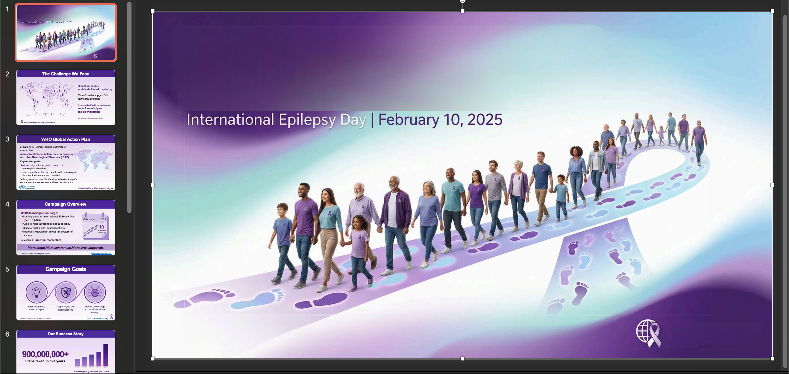
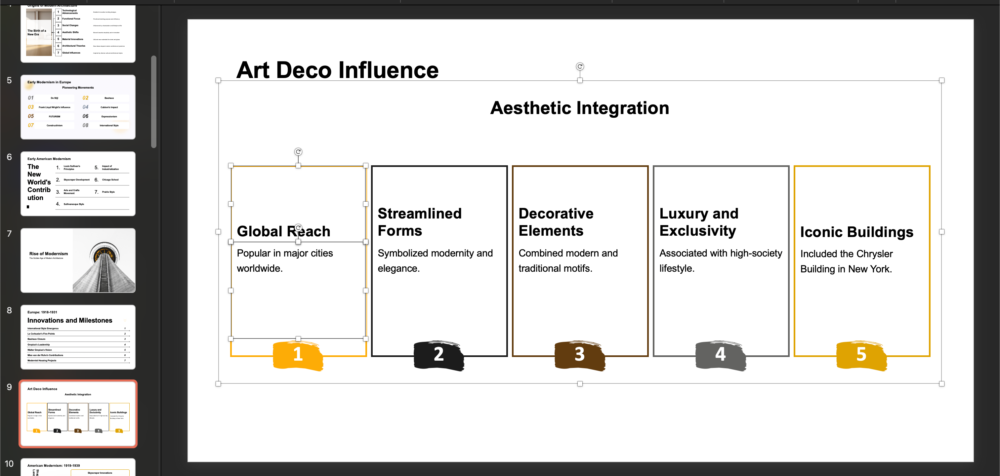
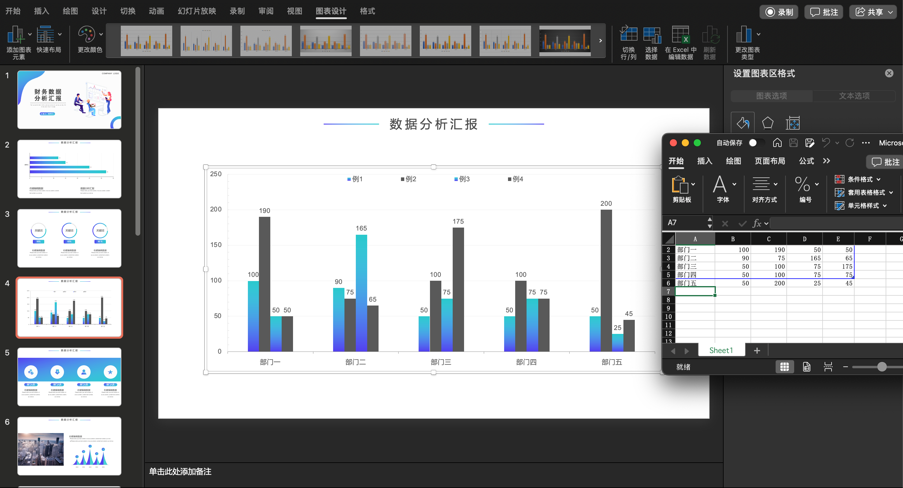
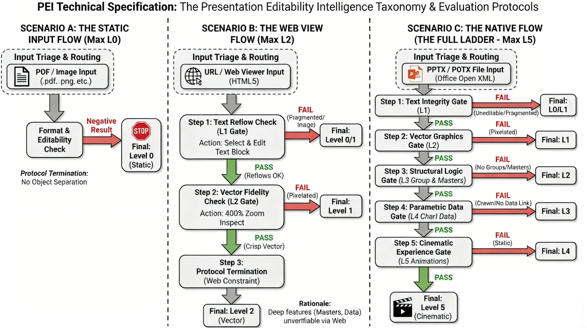

# Detailed Specifications of the PEI Taxonomy

## Executive Summary
The **Presentation Editability Intelligence (PEI)** framework is a hierarchical standard for evaluating the structural integrity, semantic logic, and editability of AI-generated presentations.
Unlike traditional metrics that measure visual similarity (e.g., FID scores), PEI measures **Editability Depth**. It asserts that a professional presentation is not merely a static image but a complex database of relationships defined by the Office Open XML standard.

### The Knockout Rule (Dependency Logic)
The framework operates on a strict **dependency-based knockout mechanism**.
*   Higher levels (e.g., L4 Data) rely on the existence of lower levels (e.g., L3 Structure).
*   **Evaluation Protocol:** If a file fails a specific criterion, evaluation ceases immediately. The file is assigned the highest level it successfully completed.
*   *Example:* A file with perfect animations (L5) but broken charts (L4 failure) is classified as **Level 3**.

## Input Triage & Routing
The evaluation process begins with **Input Format Analysis**, which determines the evaluation pipeline and the **Maximum Attainable Level (MAL)**.

### Scenario A: The Static Input
*   **Supported Formats:** `.pdf`, `.png`, `.jpg`, `.jpeg`
*   **Protocol:** **Immediate Termination**.
*   **Maximum Attainable Level:** **L0**
*   **Technical Rationale:** These formats are flattened raster containers. They do not support object separation, text reflow, or XML data binding.

### Scenario B: The Web Input
*   **Supported Formats:** `URL` (Web Viewers, HTML5 Decks, Online Canvas links)
*   **Protocol:** **Visual Inspection Only**.
*   **Maximum Attainable Level:** **L2 (Vector)**
*   **Technical Rationale:** Web viewers render the Document Object Model (DOM) visually but obscure the underlying file structure. It is technically impossible to verify deep editability features—such as Master Slide inheritance (`p:sldMaster`) or embedded Excel binary binding (`c:chart`)—through a standard web interface. Therefore, the score is capped at the limit of visual verification (L2).

### Scenario C: The Native Input
*   **Supported Formats:** `.pptx`, `.potx` (Office Open XML formats)
*   **Protocol:** **Full Deep-Scan Evaluation**.
*   **Maximum Attainable Level:** **L5 (Cinematic)**
*   **Technical Rationale:** These files provide full access to the XML schema, allowing verification of Master Slides, Data Relationships, and Animation Timings.

## The PEI Hierarchy: Detailed Definitions
This section defines the technical criteria for each level.

| Level | Class Name | Operational Status | Technical Hallmark | Critical Failure Condition |
| :--- | :--- | :--- | :--- | :--- |
| **L5** | *Cinematic* | **Dynamic Experience** | Animation Logic, Media Embeds | Static slides only; Videos treated as static images; No temporal transitions. |
| **L4** | *Parametric* | **Enterprise Tool** | Native Data (`<c:chart>`), SmartArt | Charts drawn as vector shapes; Data uneditable (broken Excel link). |
| **L3** | *Structural* | Functional Tool | Global Masters (`<p:sldMaster>`) | Hardcoded layouts (no master inheritance); Logical groups ungrouped. |
| **L2** | *Vector* | *Visual Toy* | SVG Paths, Scalable Primitives | Icons or diagrams become blurry when zoomed in; Text fragmentation. |
| **L1** | *Patchwork* | *Text-Editable Toy* | Raster Backgrounds + OCR Text | Rasterized Text (OCR failed); Non-selectable background elements. |
| **L0** | *Static* | *Flat Image* | Text is rasterized pixels | --- |

### Phase 0: The Flat Phase

#### Level 0: Static (The Flat Image)
*   **Definition:** The content is indistinguishable from a static bitmap.
*   **Technical Hallmark:** Content is flattened. Text is rasterized pixels, not character strings.
*   **Critical Failure Condition (Knockout):** N/A (Bottom of the hierarchy)

### Phase 1: The Visual Phase (Surface Fidelity)

#### Level 1: Patchwork (The Text-Editable Toy)
*   **Definition:** The file contains editable elements, but they are fragmented and structurally broken.
*   **Technical Hallmark:** "OCR-style" reconstruction. Paragraphs are split into multiple single-line text boxes. Layouts rely on absolute positioning coordinates rather than flow.
*   **Critical Failure Condition (Knockout):**
    *   **Rasterized Text:** The "text" looks like letters but is actually an image (bitmap). Users cannot select, copy, or edit the characters.
    *   **No Selectability:** Clicking on content selects the entire slide background instead of individual elements.

> **Level 1 Examples:**
> 
> 

#### Level 2: Vector (The Visual Toy)
*   **Definition:** Visual clarity is achieved via vector graphics, but elements lack logical grouping.
*   **Technical Hallmark:** Usage of SVG paths and Scalable Primitives. Graphics remain sharp at 400% zoom.
*   **Critical Failure Condition (Knockout):**
    *   **Pixelated Graphics:** Icons or diagrams become blurry when zoomed in (indicating they are Screenshots, not Vectors).
    *   **Text Fragmentation:** Paragraphs are broken into separate text boxes for each line (failing the "Reflow" requirement of a true Vector container).

> **Level 2 Examples:**
> 
> 

### Phase 2: The Structural Phase (Logic & Data)

#### Level 3: Structural (The Functional Tool)
*   **Definition:** The system adheres to presentation software logic (Masters and Grouping).
*   **Technical Hallmark:**
    *   **Logical Grouping:** Related vector elements are bound using the Group function.
    *   **Master Inheritance:** The file utilizes the `<p:sldMaster>` schema. Layout changes in the Master View propagate globally to all slides.
*   **Critical Failure Condition (Knockout):**
    *   **Atomic Isolation:** Complex graphics consist of hundreds of loose shapes requiring individual selection (No Grouping).
    *   **Hardcoded Backgrounds:** Background elements are pasted onto every individual slide rather than inherited from the Master Slide.

> **Level 3 Examples:**
> 
> 

#### Level 4: Parametric (The Enterprise Tool)
*   **Definition:** Visuals are driven by native data parameters.
*   **Technical Hallmark:**
    *   **Native Data Binding:** Charts are instantiated as `<c:chart>` objects linked to an embedded Excel binary (`.xlsx`).
    *   **SmartArt/Diagrams:** Process flows use semantic connectors, not just distinct lines.
*   **Critical Failure Condition (Knockout):**
    *   **"Dead" Vector Charts:** A chart looks perfect but is constructed from static rectangles and text boxes. Right-clicking shows "Ungroup" instead of "Edit Data".
    *   **Broken Data Link:** The chart object exists, but the underlying Excel data is missing or corrupt.

### Phase 3: The Experience Phase (Time & Narrative)

#### Level 5: Cinematic (The Dynamic Experience)
*   **Definition:** The presentation functions as a directed, temporal narrative.
*   **Technical Hallmark:**
    *   **Animation Logic:** Elements utilize Build-In/Build-Out effects sequences that match the reading order.
    *   **Native Media:** Video/Audio is embedded in the DOM with playback controls.
*   **Critical Failure Condition (Knockout):**
    *   **Static State:** The presentation is functionally perfect (Data & Structure are correct), but lacks time-dimension attributes (No animations, no transitions).
    *   **External Dependency:** Media files are linked to a local path on the creator's machine rather than embedded, causing playback failure.

## Evaluation Protocols
Select the protocol below matching your input type.

### Protocol A: The Static Flow
**Input:** PDF / Image
**Procedure:**
1.  **Format Check:** Identify file extension (`.pdf`, `.png`, etc.).
2.  **Editability Check:** Attempt to select text or move an object.
    *   *Result:* Negative.
3.  **Final Classification:** **Level 0 (Static).**

### Protocol B: The Web Flow
**Input:** URL / Web Viewer
**Constraint:** Max Rating = L2.

#### Step 1: Text Reflow Validation (L1 Check)
*   *Action:* Click on a text block in the web view.
*   *Check:* Is it selectable text? If you delete words, does the text box resize or reflow naturally?
*   *Decision:*
    *   If Text is Image or Unselectable: **Classify as L0.**
    *   If Text is fragmented/does not reflow: **Classify as L1.**
    *   If Text behaves correctly: **Proceed to Step 2.**

#### Step 2: Vector Fidelity Validation (L2 Check)
*   *Action:* Zoom browser to 400%. Inspect icons and diagrams.
*   *Check:* Are edges crisp (Vector/SVG) or pixelated (Raster)?
*   *Decision:*
    *   If Pixelated: **Classify as L1.**
    *   If Crisp/Vector: **Classify as L2.**

#### Step 3: Protocol Termination
*   *Reasoning:* Web views cannot reliably prove the existence of Master Slides or editable Excel data.
*   *Final Classification:* **Level 2 (Vector).**

### Protocol C: The PPTx Flow
**Input:** PPTX File
**Procedure:** Perform checks sequentially. Stop immediately upon failure.

#### Step 1: The Text Integrity Check (L1 Gate)
*   *Action:* Select a paragraph. Edit the text to double its length.
*   *Criteria:* The text must stay within its container and wrap automatically. The paragraph must be a single object, not multiple lines.
*   *Result:*
    *   **Fail:** Content is uneditable (L0) or fragmented (L1). **STOP.**
    *   **Pass:** **Proceed to Step 2.**

#### Step 2: The Vector Graphics Check (L2 Gate)
*   *Action:* Zoom to 400%. Inspect non-text elements (icons, shapes).
*   *Criteria:* Elements must be vector shapes (Shapes/SVG), not raster screenshots.
*   *Result:*
    *   **Fail (Pixelated):** **Downgrade to Level 1. STOP.**
    *   **Pass:** **Proceed to Step 3.**

#### Step 3: The Structural Logic Check (L3 Gate)
*   *Action A (Grouping):* Click a complex icon. Does it move as one unit (Group) or scatter into pieces?
*   *Action B (Masters):* View $\rightarrow$ Slide Master. Add a distinct shape to the layout. Close Master View. Does the shape appear on the slides?
*   *Criteria:* Complex elements must be grouped; Layouts must inherit from Master.
*   *Result:*
    *   **Fail:** **Classify as Level 2. STOP.**
    *   **Pass:** **Proceed to Step 4.**

#### Step 4: The Data Native Check (L4 Gate)
*   *Action:* Identify a chart. Right-click the chart area. Look for "Edit Data."
*   *Criteria:* The "Edit Data" option must exist and successfully open an embedded Excel sheet. Changing a value in Excel must instantly update the chart visual.
*   *Result:*
    *   **Fail (No option/Broken link):** **Classify as Level 3. STOP.**
    *   **Pass:** **Proceed to Step 5.**

#### Step 5: The Cinematic Check (L5 Gate)
*   *Action:* Run "Slide Show" mode from the beginning.
*   *Criteria:* Slides must transition automatically or smoothly. Elements should animate in (Build-ins). Embedded video must play natively.
*   *Result:*
    *   **Fail (Static Show):** **Classify as Level 4. STOP.**
    *   **Pass:** **Classify as Level 5 (Cinematic).**
